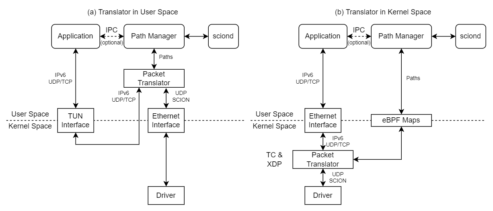

SCION-IP Translation
====================
Currently, there are two ways to use applications in a SCION network. The applications must either
be modified to use a SCION end host API directly (snet, PAN, scion-rs, etc.) or a SCION-IP Gateway
(SIG) is deployed to tunnel IP traffic over SCION. In this document we propose a third option
*SCION-IP Translation* comparable to the SIG but based on direct translation of IPv6 packets to
SCION and vice versa.

Motivation
----------
SCION has its own custom dataplane independent from and incompatible with IP. The SCION dataplane is
not natively supported by any operating system and is implemented in user space. In order to benefit
from SCION, applications must be modified or build from the ground up to use a SCION API instead of
the BSD socket interface. Because of the high effort to use SCION there are currently only very few
native SCION applications.

IP applications can benefit from SCION by tunneling their packets through SCION with a SCION-IP
Gateway. A drawback of the Gateway is that path selection is no longer controlled by the end host.
Therefore, the host cannot control multi-path communication either. Finally, the SIG introduces a
tunneling protocol with its own header, and packet fragmentation and reassembly system. Packet
fragmentation and reassembly is unfortunately impossible on high-speed P4 routers [[Kellaway,
2022](https://essay.utwente.nl/93101/)] and difficult in eBPF.

Recently, it has been discused to use IPv6 as SCION's dataplane by transforming the bespoke SCION
routing header into an IPv6 routing extension. SCION as IPv6 extension still does not solve OS
support for SCION in the near term however, as the new IPv6 extension must be integrated into
existing IPv6 stacks. As part of the discussion a number of ways to address SCION hosts with IPv6
addresses have been proposed. Based in the idea of translating between SCION and IPv6 addresses, we
propose a protocol translator that replaces the IPv6 header of outgoing packet with an equivalent
SCION header (over an IPv6 underlay) and the SCION header of incoming packets with an IPv6 header
understood by the OS and applications. The translator would be deployed on the end host, so path
control is not moved into the network. Alternatively, the SCION-IP translator could also be
understood as a replacement for the SIG if deployed outside of the host, e.g., as part of a router.

SCION-IP Translator Design
--------------------------
The SCION-IP Translator has two main components, the path manager and the packet translator. The
path manager takes care of fetching and refershing paths as well as selecting the most appropriate
paths for a certain combination of destination AS and application. The packet translator is
responsible for rewriting the packet by inserting or removing the SCION header.

Ideally, the translator should be located between the native network stack of the host and the NIC.
There are two ways to achieve that: Implement the translator as a kernel module or driver, or
implement it in eBPF as an XDP or TC program. eBPF seems much simper and safer (as eBPF runs in an
isolated VM in the kernel) than writing a kernel module. Unfortunately, eBPF is only supported on
Linux, so a different soultion is required for other Unixes, Windows, and Android (which has only
very limited eBPF support). On systems that do not support eBPF, a kernel module/driver is needed.

A simpler approach would be a user space implementation. Application traffic would be funneled into
a tun device created by the translator application, rewritten, and forwarded to the border router
using UDP sockets. Although limited in performance as the userspace-kernel boundary has to be passed
at least twice, a user space implementation would be well suited to "closed" platforms like Android.



If the SCION-IP Translator is used as a replacement for a SIG, it could also be implemented in P4
for Intel Tofino switches. It is likely that throughput in the Tbit/s range can be achieved this way.

### Reuseing Software Components of WireGuard
The SCION-IP Translator has a similar task to VPNs, it adds and removes a tunnel header (i.e.,
SCION) before the rest of the IP stack parses the tunneled packet. WireGuard is available on many
platforms and has been implemented in both user and kernel space. We can make use of parts of the
WireGuard project for the translator. For example, the wintun component which allows user space
applications to create tunnel devices on Windows and wireguard-nt, a Windows driver implementing the
WireGuard protocol in the NT kernel. The WireGuard Android app could likely be merged with the SCION
Android app to create a "SCION-VPN" app for Android.

We also plan to investigate whether we can fully merge SCION-IP translation, WireGuard tunneling,
and a DMTP gateway in a single WireGuard-like client as there are many shared components, albeit
used in different combinations depending on the tunneling/translation scenario.

### Address Mapping
At the moment, we are working with a static mapping of IPs to SCION ISD and ASN. We use the
[ULA](https://datatracker.ietf.org/doc/html/rfc4193) prefix `fc00::/7` to mark SCION addresses. The
prefix is followed by the ISD (e.g., 9 bits), the ASN (e.g., 16 bits) a network prefix (e.g., 32
bits) and the interface address (64 bits). The hosts are configured to route `fc00::/7` to the tun
interface for user space translation or directly to the real Ethernet interface for in-kernel
translation. The "IPv6-mapped SCION addresses" are used as the primary IPv6 addresses of the hosts
and are still reachable by other IP hosts. As IPv6-mapped SCION addresses are used for both IP
routing and SCION path selection, the SCION-IP translation can happen anywhere on the path or even
back and forth multiple times to combine SCION and non-SCION segments.

As discussed in https://github.com/scionproto/scion/discussions/4324 , static mapping has some
drawbacks as there is not enough space in the IPv6 address to encode the entire SCION address. An
address lookup service could be considered instead if the static mapping becomes to limiting.

### Path Selection
By default, the translator is selecting paths on behalf of the IP applications. Paths are selected
based on the port number and protocol (TCP/UDP) the application uses, e.g., send UDP traffic over
low latency paths and TCP traffic over high bandwidth paths. IP applications can influence the path
selection using the DSCP field [[RFC2474](https://datatracker.ietf.org/doc/html/rfc2474)] in the IPv6
header. (setsockopt with `IPPROTO_IPV6` and `IPV6_TCLASS` in Linux, QoS [policies][1] and [API][2]
in Windows)

[1]: https://learn.microsoft.com/en-us/windows-server/networking/technologies/qos/qos-policy-manage
[2]: https://learn.microsoft.com/en-us/windows/win32/api/_qos/

Direct path control can be offered through an API. The translator API can be used by the traffic
generating applications themselves or by system-wide management tools that select paths for other
applications. For example, there could be a GUI tool allowing end users to view selected paths and
set global or application-specific path policies.

In order for the applications originating traffic to select paths themselves, they have to be made
SCION-aware to some extent. The advantage of using the translator instead of a native SCION API in
this case is that the performance-critical IO part of the application does not need to be modified
which tends to be much more work than just setting path policies. Additionally, if the translator's
data plane is situated within the kernel, we expect IO performance to be better than with the native
SCION APIs in user space.

### Support for TCP and MP-TCP in SCION
As the translator leaves the IP/TCP stack of the kernel intact, TCP sockets work transparently over
SCION. Even multipath TCP can be supported by mapping different substreams to different SCION paths.
MP-TCP in Linux allows user space [path managers](https://github.com/multipath-tcp/mptcpd) to
augment or replace the built-in kernel path manager. A SCION-aware path manager could guide MP-TCP
to create one substream per available SCION path. MP-TCP packet scheduling is in principle
controllable from [eBPF](https://github.com/multipath-tcp/mptcp_net-next/issues/75) which enables us
to flexibly allocate different amounts of bandwidth on each SCION path.

Benefits
--------
- With a translator any IPv6 applications supports SCION. It just has to be given an IPv6-mapped
SCION address and the translator takes care of the path selection.
- IP and SCION applications can communicate directly with one another. An IP application with a
translator would be indistinguishable from a native SCION application to other hosts.
- Support for TCP and MP-TCP in SCION.
- For kernel implementations host performance should be similar to native sockets.
- Likely higher performance than the SIG, especially on Tofino.

Challenges
----------
### MTU Restrictions
The translated packets may be larger than the MTU of the underlying link. As the SCION headers are
relatively large, translating IPv6 packets will often lead to packets that are too large. The SIG
avoids this problem by fragmenting packets.

Ways to communicate the reduced MTU to applications:
1. Set the link MTU on the host interface conservatively to reduce the risk of translated packets
exceeding the MTU.
2. Drop packets that are too large and respond with an ICMPv6 Packet Too Big message. Path MTU
discovery [[RFC1981](https://datatracker.ietf.org/doc/html/rfc1981)] in the kernel should
automatically adjust the packet size for TCP and notify applications using UDP by letting writes
fail with `EMSGSIZE`. If paths are switched from a longer to a shorter path in the middle of a
connection, this might lead to a lower than ideal MTU being used for some time.

The minimum link layer MTU required by IPv6 is 1280 bytes
[[RFC8200](https://datatracker.ietf.org/doc/html/rfc8200)]. Assuming SCION using an IPv6 underlay with
a link MTU of 1500 bytes, this leaves only 220 bytes for the UDP underlay and SCION headers. Without
any header extensions 220 bytes are enough for only 8 hops.
```
220 byte
    -  8 byte (UDP)
    - 12 byte (common hdr)
    - 48 byte (addr hdr)
    -  1 byte (path meta)
    -  3 * 8 byte (3 info fields)
= 127 bytes
127 bytes / 12 byte (hop field) = 10.58 HFs
```

### Path Cache Misses
If the translator encounters a packet for which it does not have a SCION path cached, it may have to
buffer the packet during the path lookup or drop the packet entirely. Buffering packets takes memory
and is not easily doable in eBPF programs or high speed routers. Both delaying or dropping packets
impacts application performance. Therefore, the path cache has to be kept warm constantly and paths
should be fetched and refreshed proactively.

### SCMP Authentication
The translator has to handle SCMP messages and either use them for path selection or translate them
to ICMP where appropriate (e.g., for echo requests/responses). In order to do so, the messages have
to be authenticated first, which requires some cryptographic operations which are not trivial in
eBPF and P4. Fortunately, we already have experience with implementing hop field verification in
both eBPF and P4 so this seems comparatively simple. As a last resort the SCMP handling has to move
entirely into the slow path.
