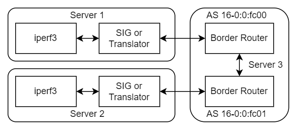
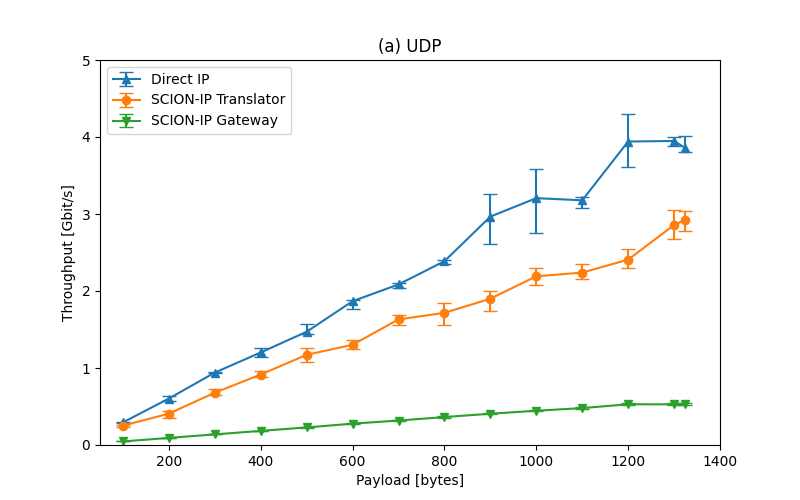
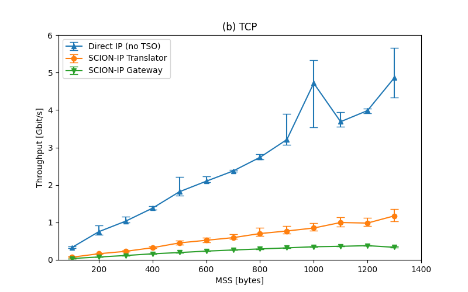
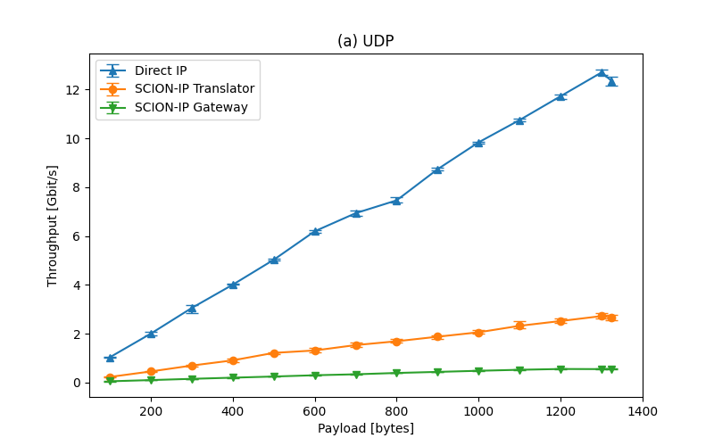
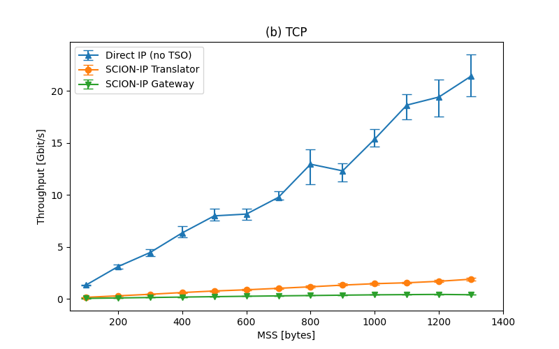

Evaluation of SCION-IP Translator eBPF Prototype
================================================

Experiments were conducted on a testbed of three servers, all connected to a central switch. The
SCION topology overlayed on the servers consisted of two SCION ASes whose infrastructure services
and routers ran on one server (Server 3), while the other two servers were used as end hosts, one in
each AS (Servers 1 and 2).



Hardware Specifications of the Servers:
- Server1: AMD EPYC 7543P (32 cores), 2x ConnectX-5 NIC @ 100 Gbit/s (only one NIC in use)
- Server2: AMD EPYC 7543P (32 cores), 2x ConnectX-5 NIC @ 100 Gbit/s (only one NIC in use)
- Server3: AMD EPYC 7543P (32 cores), 2x ConnectX-6 NIC @ 200 Gbit/s (only one NIC in use)

## Testbed Setup

The [setup](./setup) directory contains notes on how to set up the network interfaces and SCION.
Interface names must be adjusted to match the systems in use. The servers in our testbed were called
Epyc 1-3 with interfaces called enp65s0np0 and enp129s0np0. Experiments were conducted with the
namespaced configuration ([testbed-namespaces](./setup/testbed-setup-namespaces.md)). The
experiments can also be conducted with less than three machines by setting up all namespaces on the
same system, see [local-testbed-namespaces](./setup/local-testbed-namespaces.md) for an example.

We use the additional namespaces to force the kernel to split TCP segments into packets that are
small enough to rewrite 1:1 to UDP. Without disabeling TSO and the extra namespace/veths most
TCP packets are not correctly processed in the TC eBPF program and will be dropped.

## Experiments

All experiments use scionproto/scion @ 15bdf63eab3b7e2191e14cb6bfac36637b24f00a

- TRA (SCION-IP Translator)
    - iperf3 server and client are in host namespaces (fc00 and fc01) of Epyc2 and Epyc3 (TSO
      disabled, MTU set to 1396)
    - Translator is in fc00-tra and fc01-tra
- SIG (SCION-IP Gateway)
    - iperf3 server and client are in host namespaces (fc00 and fc01) of Epyc2 and Epyc3 (TSO
      enabled, MTU set to 1396)
    - SIG is in fc00-tra and fc01-tra
- IP (IP forwarding, no SCION)
    - iperf measurements between host namespaces fc00 and fc01 (TSO remains disabled on the veths,
      MTU set to 1396)
- IP_TSO (same as IP, but with TSO)
    - iperf measurements between translator namespaces fc00-tra and fc01-tra (TSO enabled)

Note: Native SCION applications match SIG results exactly as they are both bottlenecked by SCION's
"dispatcher". Higher performance is expected without the dispatcher and should be considered in the
future.

All bandwidth measurements were taken using iperf3 version 3.17.1, with the shell script
[iperf.sh](./iperf.sh). A similar script for SCION's bwtester (from scion-apps) is available as well
with [bwtest.py](./bwtest.py). There are some latency measurements as well (files ending in LAT)
that were taken using a simple UDP echo server.

## Results

Results can be plotted using the [results.py](./results.py) script.

Our results are availlable here: https://cloud.ovgu.de/s/FBxbN36Z2FE3RGy
Download to `./data` and untar:
```bash
cd data
for f in *.tar.bz2; do tar -xjf "$f"; done
```

### Single iperf thread
For a single sendind thread, the performance of the eBPF programs is acceptable. TCP suffers more as
we have to disable TSO.




### Four iperf threads
However, it does not scale with more sending threads. TODO: Figure out why.



